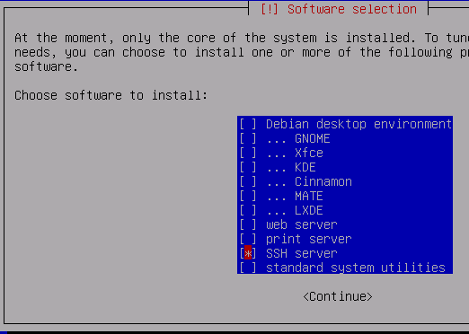
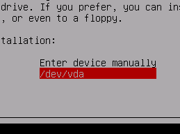

## Official Guide Moved Here:

https://steemit.com/zencash/@hairetikos/minimal-vultr-and-other-1gb-vps-optimal-zen-secure-node-guide

# Minimal VPS Node
Minimal Vultr VPS Setup by Hairetikos.  A foundation for optimal Zen Secure Node and challenge computation.

https://github.com/ZencashOfficial/zen

https://github.com/adumaine/secnodetracker

*This should also work for any other VPS provider who allows one to upload a custom ISO and install it via VNC console.  It is also useful in general as a foundation for other server applications*

By the end of this guide you should have an ultra-lightweight & fast Debian system consuming as little as 23MB RAM at boot time and just 3-5 processes.  It is an optimal foundation to build your system up from.

## Please Note ...

From this setup, I am getting steady secnodetracker challenge times on average of 3:31. 

If you are exceeding 5:00 after this minimal setup, please repeat some of the steps at the bottom of this page such as reinstalling `sysvinit-core` and removing `systemd*` (some future packages may have installed systemd along with them, some packages will install it even though it is not an explicit dependancy)

Also, after installing packages and compiling software you may consider clearing the cache as follows:

1.  Terminate `zend` and `secnodetracker` (as regular user)
2.  `swapoff -a` (as root)
3.  `sync && echo 3 > /proc/sys/vm/drop_caches` (as root)
4.  `swapon -a` (as root)
5.  Restart `zend` and `secnodetracker` (as regular user)

*If you are still exceeding 5:00 challenge times after this guide, it may be congestion in your particular Vultr datacenter -- consider choosing a different VPS location and testing the difference.*

## Installation

First, right click and copy the link to the Debian Net Install ISO.  The ISO can be found at the bottom of the Debian netinst download page https://www.debian.org/CD/netinst/

Create a new server at Vultr.  When prompted for "Server Type", choose "Upload ISO"

Paste the Debian Net Install ISO link

*wait a moment for it to upload.  You may need to refresh the page to check.*

Make sure the ISO is selected when creating the server

Finish creating the server how you want it.*(Choose as little as 1CPU 1024MB Server Size)*

When the server is ready, open the secure VNC console by clicking the console icon at the top of the Overview page.

Choose the "Install" option and press enter

Choose your language and follow the setup steps to configure your hostname and domain (can be anything), root password, and regular user account

Choose Manual Partitioning

Select Virtual Disk 1 and press enter to create a new partition table

Now select the FREE SPACE and press enter

Create a new primary partition

Allocate 7GB for SWAP

Highlight "Use as:" and press enter

Choose "swap area" and press enter

Now select the remaining FREE SPACE and press enter

Make the filesystem `EXT2`, `EXT3` or `EXT4`

*as the disk is small, for faster disk performance in many cases choose `EXT2` (no journal), for better recovery after crashes choose `EXT3` or `EXT4` (journal)*

**Be sure to choose Mount option `noatime` to improve disk performance.
(it also implies `nodiratime`, so we don't need to select both)**

Set `Reserved blocks` to 0% or 1% so we can use the whole disk, as it is not a large disk.
*Note:  If the disk fills up, a 0% option may cause inoperability, be sure to monitor and administer the server -- some log files may grow large for example*

Write the changes to disk and proceed with the installation

Select no here

Choose the mirror according to where your Vultr VPS is located (i.e:  Japan for Tokyo server)

On the next screen, choose the first option (choices will differ depending on region)

Leave this blank (unless you want to configure a proxy)

Don't participate in the package use survey

Use spacebar to uncheck ALL options except `SSH server` (even uncheck `standard system utilities`) 
All we need is `SSH server` to login to the VPS

Yes, install GRUB to the MBR

Select `/dev/vda`

The installation should now finish!

After the Installation finishes, navigate to your Vultr server Settings and **Remove the ISO**

Navigate to IPv4 Settings in Vultr and click `networking configuration`

Scroll down to the Debian 9 settings

Now use SSH to login to your Vultr server from a terminal.
`ssh [username]@[VultrAddress]`

(if the ISO was left in after installation, it may need a reboot -- check the Vultr VNC console you was using during the installation)

invoke the command `su` to become root *(# symbol indicates the command should be invoked as root)*, then edit the network config:

`# nano /etc/network/interfaces`

replace the config with the Vultr static IP config.  Press `ctrl + o` then `enter` to save, `ctrl + x` to exit.

edit the `inittab`

`# nano /etc/inittab`

remove useless `getty`s we don't need, just leave the first one, delete the highlighted lines shown below:

save the file and exit

replace bloated `systemd` init with traditional UNIX-style `sysvinit`, install `htop` for process monitoring and control, and reboot into `sysvinit` system. run:

`# apt install htop sysvinit-core -y && reboot`

after reboot, purge the useless remaining bits of `systemd`, also remove `rsyslog` if you do not use it, and reboot once more.

`# apt purge rsyslog systemd* -y && apt autoremove --purge -y && reboot`

stop `udev` after boot:

`# service udev stop`

now sync and free the RAM:

`# sync && echo 3 > /proc/sys/vm/drop_caches`

You should now have an ultra-lightweight and fast debian system!
Invoke `htop` to see current RAM and process usage.

*From here you can follow the regular secure node guide to get ZEN and secnodetracker installed!*

If this guide has helped you, consider a donation:

**ZEN:** `znk9ZJEof1jjjkYPwsAP91rxozEvYPeVVUz`

**Private ZEN:** `zcbicMhjYbyAgNgRi1HH7zDJn97xFrgMjG4CnznyJiSzGovYmgwefF7Dxq2QrwYXnqcpPpxwYRfoav5GyXz96oWNxGUAFy4`

**BTC (bech32):** `bc1qsnn8mf9fsz5cnadrj3lszshu5u9hx3d6gs8yaj`

**BTC (legacy):** `1PRNi9rrNpPfbBSZnwA9mgJCSrhHnaQLcU`
